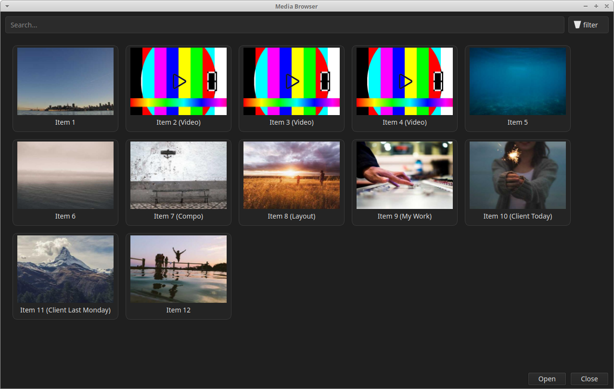
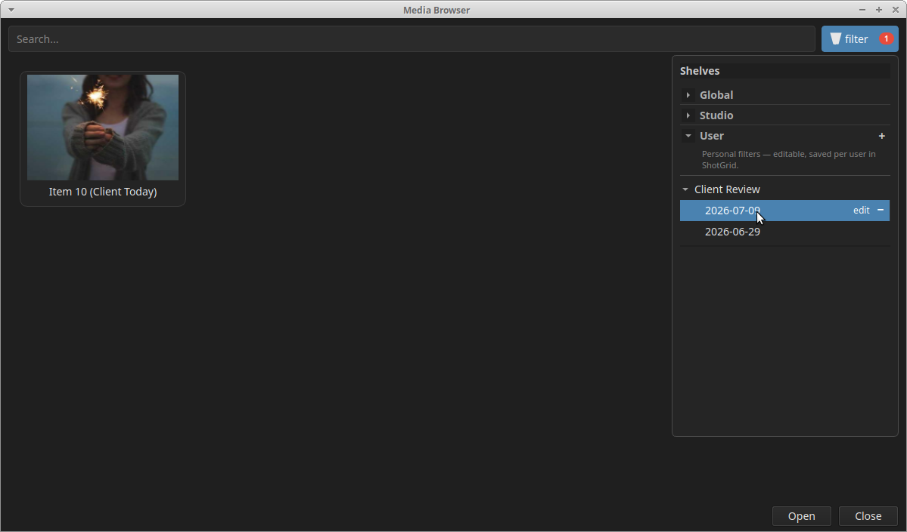
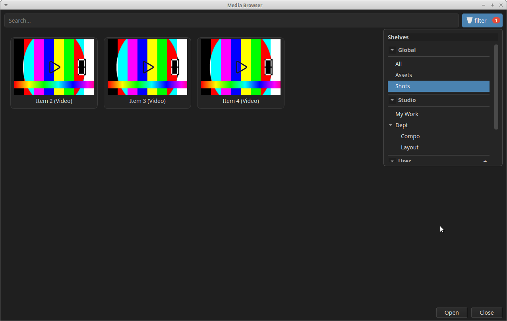
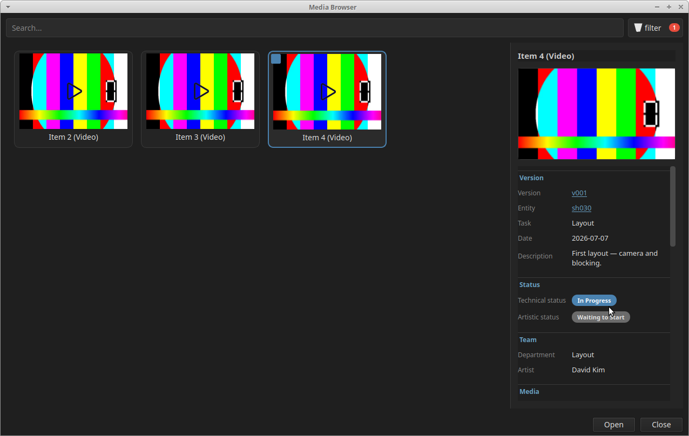
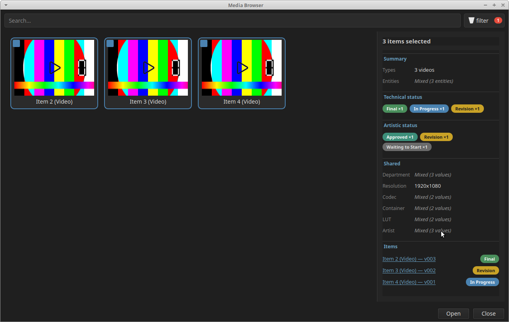

# Media Browser

A **PySide6** desktop application for browsing production media (images and videos), inspired by **ShotGrid** workflows. The POC provides a filterable media grid, a ShotGrid-style shelf panel, and a rich details sidebar with Version metadata.

---

## Overview



The main window is organized around three areas:

| Area | Description |
|------|-------------|
| **Toolbar** | Search field + **filter** button |
| **Media grid** | Thumbnails for the current filter and search query |
| **Details panel** | Appears on the right when one or more media are selected |

The old fixed left shelf panel has been replaced by a **floating filter popup** anchored to the filter button (ShotGrid-style).

---

## Filter panel (Shelves)



Click the **filter** button next to the search bar to open the shelf panel. Click the button again to close it. The panel stays open while you browse filters and only closes when you toggle the button.

Filters are grouped into **three collapsible sections**. Each section has a short description in the UI.

### Global

**Source:** application (read-only)

Built-in entity filters, always available and identical for every user:

| Filter | Description |
|--------|-------------|
| **All** | Every media item |
| **Assets** | Asset versions only |
| **Shots** | Shot versions only |

These filters map to top-level entity types and are not configurable.

### Studio

**Source:** ShotGrid preset packages (read-only)

Studio-wide filters defined by the pipeline team in the **ShotGrid preset packages**. They are deployed with the studio configuration and shared across all users. Examples in the POC:

| Group | Filters |
|-------|---------|
| **Dept** | Compo, Layout, Animation, … |
| **Roles** | CG Sup, Leads, Artists, … |
| **Assigned Tasks** | Assigned to me, To review, … |

Typical use cases:

- browse media per **department**
- filter by **role** (supervisor, artist, lead, …)
- show **tasks assigned** to the current user or awaiting review

Users cannot add, edit, or delete Studio filters from the Media Browser.

### User

**Source:** ShotGrid — per user (editable)

Personal filters that each user creates for their own workflow. They are **stored in ShotGrid** and persist across sessions and machines.

Examples:

- a **Client Review** shelf with dated sub-filters
- a custom grouping for a specific sequence or delivery

The User section supports:

- **+** (top right) — add a filter using **ShotGrid filter codes** (same syntax as the ShotGrid **Filter** button)
- **edit** — rename a filter or update its filter code (hover a row)
- **−** — remove a filter from the list (does not delete media)

#### ShotGrid filter codes

User filters are defined with the **same filter codes as ShotGrid's Filter button** — the standard `field / operator / value` expressions used in the ShotGrid web UI and API.

When clicking **+**, the user provides:

| Field | Description |
|-------|-------------|
| **Name** | Display label for the shelf |
| **Filter code** | ShotGrid-compatible criteria (e.g. `["sg_status_list", "is", "rev"]`) |

These criteria are stored in ShotGrid with the user's saved filter and replayed when the shelf is selected.

**Examples (POC):**

```
["sg_status_list", "is", "rev"]
["client_review_date", "is", "2026-07-09"]
["department.Department.name", "is", "Compositing"]
["task.Task.assignees", "name_is", "Current User"]
```

Studio filters from the **preset packages** use the same code format; only the **User** section allows creating and editing them from the Media Browser.

User filter actions are painted in the tree (no child widgets) to avoid window glitches on Linux.

### Section summary

| Section | Defined by | Editable | Persisted in |
|---------|------------|----------|------------|
| **Global** | Application | No | — |
| **Studio** | ShotGrid preset packages | No | ShotGrid studio config |
| **User** | End user | Yes | ShotGrid (per user) |

Each section can be expanded or collapsed independently. Section height adapts to its content.

### Filter button badge

When any filter other than **All** is active, the filter button shows a red capsule badge (`1`) inside the button.

---

## Media grid



The grid displays media for the active shelf filter and search text. The layout reflows automatically when the window is resized.

### Selection

| Action | Result |
|--------|--------|
| **Left-click** | Select a single item |
| **Ctrl + click** | Toggle item in selection |
| **Shift + click** | Range selection from last anchor |

Selected items show a checkbox and a blue highlight border.

### Search

The search field filters media by **title** (case-insensitive, live update).

### Media items

Each item shows:

- a **thumbnail**
- a **title**
- a **checkbox** when selected

**Videos** support hover preview (scrub via mouse position). A play icon overlay indicates video items.

---

## Details panel



The details panel slides in on the **right** when you select media. It is **hidden** when nothing is selected.

### Single selection

Clicking one media opens the full **Version** detail view:

| Section | Fields |
|---------|--------|
| **Version** | Version, Entity, Task, Date, Description |
| **Status** | Technical status, Artistic status (colored badges) |
| **Team** | Department, Artist |
| **Media** | Type, Resolution, Codec, Container, Frame in/out, Duration, Frame count, FPS |
| **Colorimetry** | LUT |
| **Organization** | Category, Section, Subsection, Playlists, Tags |
| **Files** | File, Thumbnail, Video file, Image URL, Frames path |
| **Notes & Reviews** | Notes and reviews with author, date, subject, and body |

#### ShotGrid links

When ShotGrid IDs are available, these fields are **clickable links** (open in the browser):

- **Version** → `/detail/Version/{id}`
- **Entity** → `/detail/Shot/{id}` or `/detail/Asset/{id}`
- **Playlists** → `/detail/Playlist/{id}` per playlist

Configure the site URL with the environment variable:

```sh
export SHOTGRID_URL="https://your-studio.shotgrid.autodesk.com"
```

Default: `https://studio.shotgrid.autodesk.com`

#### Status badges

Technical and artistic statuses use colored capsule badges (Final, Revision, In Progress, Approved, etc.).

---

### Multi-selection



Selecting **two or more** media (Ctrl / Shift) shows a **summary** instead of full per-item details:

- **Summary** — item count, types (e.g. `2 videos, 1 image`), entities (shared or `Mixed`)
- **Technical / Artistic status** — count badges per status (e.g. `Final ×2`, `Revision ×1`), wrapping to multiple lines when needed
- **Shared** — Department, Resolution, Codec, Container, LUT, Artist (shared value or `Mixed (N values)`)
- **Items** — scrollable list of `Title — version` with ShotGrid links and status badge per row

---

## Running the POC

1. **Clone the repository and enter the project directory**

   ```sh
   git clone <repo-url>
   cd mediaBrowser
   ```

2. **(Recommended) Create a virtual environment**

   ```sh
   python -m venv venv
   source venv/bin/activate   # Windows: venv\Scripts\activate
   ```

3. **Install dependencies**

   ```sh
   pip install -r requirements.txt
   ```

4. **Run the application**

   ```sh
   python main.py
   ```

5. **(Optional) Set your ShotGrid URL**

   ```sh
   export SHOTGRID_URL="https://your-studio.shotgrid.autodesk.com"
   python main.py
   ```

---

## Project structure

```
mediaBrowser/
├── main.py           # Application entry point (PySide6 UI + sample data)
├── requirements.txt
├── images/           # Cached thumbnails (created at runtime)
├── videos/           # Sample video files
├── icons/            # UI icons (e.g. play.png)
└── docs/             # Screenshots and documentation assets
```

The current POC uses **in-memory sample data** in `main.py`. Production integration would replace this with a PMS / ShotGrid API layer.

---

## Architecture (target)

The long-term goal is a **PMS-agnostic** media browser driven by plugins:

- **IShelves** — list of shelves and filter criteria
- **IMediaList** — media for the active shelf

A shared **GraphQL-based schema** is envisioned for plugin communication. The current POC implements the UI in **Python / PySide6** (`main.py`) without QML.

### Example shelf schema (target)

```graphql
type Shelf {
  name: String!
  parent: Shelf
  filters: [ShelfFilter!]
}

type ShelfFilter {
  label: String!
  criteria: String!   # ShotGrid filter code (same syntax as the Filter button)
}

type Query {
  shelves: [Shelf!]!
}
```

### Example media schema (target)

```graphql
type Media {
  name: String!
  thumbnailPath: String!
  mediaPath: String!
}

type Query {
  mediaList(shelfId: ID!): [Media!]!
}
```

The details panel is designed to map naturally onto **ShotGrid Version** fields (status, artist, department, resolution, playlists, notes, etc.).

---

## Suggested screenshots

If you want to complete the documentation, these captures are especially useful:

| File | Content |
|------|---------|
| `docs/main-window.png` | Full window — search, grid, no selection |
| `docs/filter-popup.png` | Filter popup open (Global / Studio / User) |
| `docs/media-grid.png` | Grid with a few items selected |
| `docs/details-panel.png` | Single item — full details + notes |
| `docs/multi-select-summary.png` | Multi-select summary panel |

Drop the files in `docs/` and the images above will render automatically in this README.
