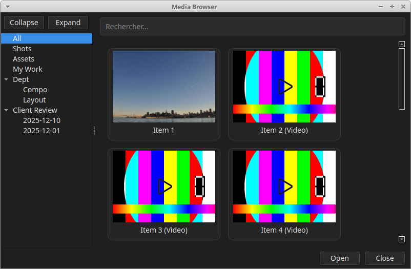
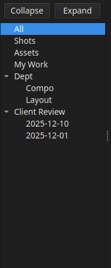
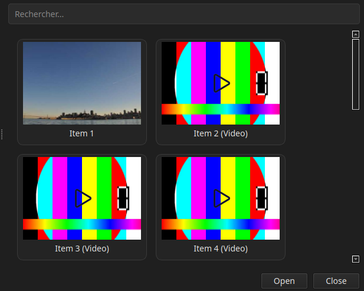
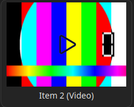
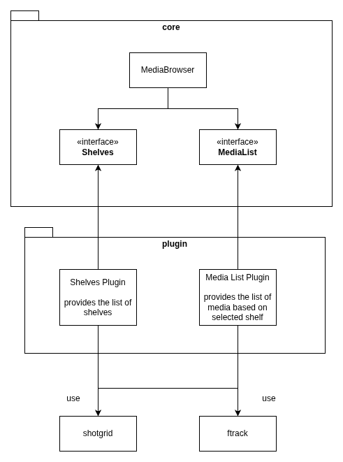

# Media Browser

## Features



The Media Browser consists of two main sections:  
- **Shelves** (on the right)  
- **Media List** (on the left)


## Shelves



Shelves are customizable categories used to organize media according to the pipeline, studio structure, or user preferences.

In the example above, the default shelves — **All**, **Assets**, and **Shots** — allow users to filter between all media, assets only, or shots only.

Additional shelves can be created, such as:  
- department shelves (e.g., *layout*, *compo*) to list all shots belonging to a specific department  
- a **Client Review** shelf to gather all media scheduled for a client review on a specific date  

Studios can customize shelves to fit their workflow.  
For example:  
- An artist may create a **My Work** shelf  
- A supervisor may create a **To Review** shelf  


## Media List



The Media List displays all media associated with the currently selected shelf. Each media item can be opened for review.

### Selection Options
- **Single selection**: left-click  
- **Multi-selection**: **Ctrl + left-click**  
- **Range selection**: **Shift + left-click**

A search field is available to filter media by name.

There is no pagination system. If a large number of media items are displayed, an **infinite scrolling** mechanism (similar to social networks) is used.


### Media Item



Each media item consists of:
- a thumbnail  
- a name  

For image sequences or video files, hovering the mouse over the thumbnail previews the sequence or video.

A visual tag is also displayed to differentiate:
- single images  
- image sequences  
- movies  


## Architecture



The `MediaBrowser` component provides core functionalities:
- media name search  
- media selection  
- infinite scrolling  
- shelf selection  
- and more  

It exposes two interfaces:
- **IShelves**: returns the list of shelves and their filtering criteria  
- **IMediaList**: receives the current shelf and returns the associated media  

Users can implement these interfaces to connect the Media Browser to their Production Management System (PMS).

Since the Media Browser is intended to be **PMS-agnostic**, a shared **GraphQL-based data schema** is used to communicate with plugins.

The UI and implementation language are **Python** and **QML**.


### Data Structure

#### Shelves

To provide the list of shelves, plugins must implement the following GraphQL schema:

```graphql
type Shelf {
  name: String!
  parent: Shelf
  filters: [ShelfFilter!]
}

type ShelfFilter {
  label: String!      # Filter description (e.g., "Only shots")
  criteria: String!   # Filter expression (e.g., "type:shot", "review_date:2023-12-15")
}

type Query {
  shelves: [Shelf!]!
}
```

Each shelf contains a list of ShelfFilter elements, representing simple filtering criteria used to restrict the displayed media.

#### Media List

To provide the list of media, plugins must implement the following GraphQL schema:

```graphql
type Media {
  name: String!
  thumbnailPath: String!   # Path to the thumbnail (local or network)
  mediaPath: String!       # Path to the image sequence (folder or file pattern) OR a single video file
}

type Query {
  mediaList(shelfId: ID!): [Media!]!
}
```

Each media object includes:
- a name
- a thumbnail path
- a media path, which may refer to:
    - an image sequence (directory or pattern), or
    - a single video file

## Running the Proof of Concept (POC)
To run the POC application locally:

1. **Clone this repository and enter the project directory**  
   ```sh
   git clone <repo-url>
   cd <your-project-directory>
   ```

2. **(Optional but recommended) Create a virtual environment**  
   ```sh
   python -m venv venv
   source venv/bin/activate  # On Windows: venv\Scripts\activate
   ```

3. **Install requirements**  
   ```sh
   pip install -r requirements.txt
   ```
   Or, if there is no `requirements.txt`, directly install dependencies (example):  
   ```sh
   pip install PySide6 requests
   ```

4. **Run the main application**  
   ```sh
   python main.py
   ```

The UI should launch displaying the available shelves and media items.